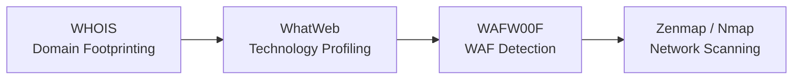

<div align="center">

# 🔍 Reconnaissance & Scanning Lab Report

### Week 2 · Information Gathering, Footprinting, Reconnaissance & Scanning


**Cybersecurity & Ethical Hacking Internship**

</div>

---

## 📑 Table of Contents

1. [Executive Summary](#1--executive-summary)
2. [Objective and Scope](#2--objective-and-scope)
3. [Tools & Environment](#3--tools--environment)
4. [Methodology](#4--methodology)
5. [Key Findings & Observations](#5--key-findings--observations)
6. [Conclusion & Recommendations](#6--conclusion--recommendations)
7. [Disclaimer](#-disclaimer)

---

## 1. 📌 Executive Summary

This lab demonstrates how much information can be gathered about a target **before any exploitation takes place**. Reconnaissance was carried out against an external domain (`networkwalks.com`, used for demonstration) and an internal lab subnet (`10.0.0.0/24`) using Kali Linux.

Four tools were used: **WHOIS** for domain registration and DNS details, **WhatWeb** for web technology profiling, **WAFW00F** for Web Application Firewall detection, and **Nmap (via Zenmap)** for host discovery, port scanning, and service enumeration. Together, they produced a detailed profile of the target's public identity, web stack, defensive posture, and internal network exposure using only publicly available data and standard network probing.

> [!IMPORTANT]
> The reconnaissance phase alone reveals enough information to plan a targeted attack. Minimizing digital footprint and hardening exposed services are essential first-line defenses.

---

## 2. 🎯 Objective and Scope

### Objectives

- Perform OSINT and footprinting on an external domain
- Fingerprint the web technology stack and detect WAF protection
- Discover live hosts, open ports, and running services on an internal subnet
- Understand the risks associated with information disclosure

### Target Scope

| Target | Type | Activities |
|---|---|---|
| `networkwalks.com` | 🌐 External | WHOIS, WhatWeb, WAFW00F |
| `10.0.0.0/24` | 🏠 Internal (local lab) | Host discovery, port and service scan |

### Out of Scope

Exploitation, credential attacks, denial-of-service, and post-exploitation activities. All work was limited to information gathering for educational purposes.

---

## 3. 🛠️ Tools & Environment

| Tool | Purpose |
|---|---|
| **WHOIS** | Domain registration data, contacts, and nameservers |
| **WhatWeb** | Web technology and HTTP header fingerprinting |
| **WAFW00F** | Web Application Firewall detection |
| **Zenmap (Nmap GUI)** | Host discovery, port and service scanning, topology mapping |

**Operating System:** Kali Linux
**Network Position:** Same network segment as the internal target subnet

---

## 4. 🧪 Methodology



### Phase 1: Domain Footprinting (WHOIS)

```bash
whois networkwalks.com
```

A WHOIS lookup was performed on the target domain to collect registration and DNS information, including the registrar, creation and expiry dates, registrant and administrative contact details (where not hidden by privacy protection), and the authoritative nameservers.

### Phase 2: Technology Profiling (WhatWeb)

```bash
whatweb networkwalks.com
whatweb -v networkwalks.com
```

WhatWeb was run in standard and verbose modes to identify the technologies behind the website. This covered the web server and its version, the CMS, scripting languages, JavaScript libraries, and HTTP response headers, including which security headers were present or missing.

### Phase 3: WAF Detection (WAFW00F)

```bash
wafw00f https://networkwalks.com
```

WAFW00F sent a series of HTTP requests and analyzed the responses to determine whether a Web Application Firewall was protecting the application and, if so, which vendor or product it was.

### Phase 4: Network Scanning (Zenmap / Nmap)

```bash
nmap -T4 -A -v 10.0.0.0/24
```

Zenmap's **Intense Scan** profile was run against the local subnet. This scan performed:

1. Host discovery to identify live devices
2. Mapping of IP and MAC addresses
3. Port scanning to classify ports as open, closed, or filtered
4. Service and version detection, OS fingerprinting, and default script scanning
5. Topology visualization of the discovered network

---

## 5. 📊 Key Findings & Observations

| # | Finding | Source | Risk Implication |
|---|---|---|---|
| 1 | Domain registration details (registrar, dates, contacts) are publicly accessible | WHOIS | Enables social engineering and phishing |
| 2 | Nameserver and DNS infrastructure is disclosed | WHOIS | Aids infrastructure mapping |
| 3 | Web server, CMS, and version information can be identified | WhatWeb | Allows attackers to look up known CVEs for those versions |
| 4 | HTTP headers reveal technology details and security header status | WhatWeb | Information leakage and weak browser-side protections |
| 5 | WAF presence and vendor can be determined remotely | WAFW00F | Tells an attacker how much evasion effort is needed |
| 6 | Live hosts were discovered with IP and MAC address mappings | Nmap | Full asset inventory visible to anyone on the segment |
| 7 | Open ports and running services were enumerated | Nmap | Every open service widens the attack surface |
| 8 | Service versions and operating systems were fingerprinted | Nmap | Enables targeted exploit selection |

### Observations

- No exploitation was required to build a detailed profile of the target.
- Default configurations and verbose banners were the biggest sources of information leakage.
- Attackers use this phase to choose their tools and attack vectors, so anything exposed here shapes the rest of an attack.

---

## 6. ✅ Conclusion & Recommendations

This lab showed how much sensitive information a target leaks to the public domain before any exploit is launched. Reconnaissance is the foundation of nearly every attack, which makes information hygiene and system hardening critical.

### 🧼 Information Hygiene

- Enable WHOIS privacy protection and use role-based contact emails instead of personal ones.
- Audit public-facing DNS records and remove unnecessary entries.
- Regularly run OSINT against your own organization to see what attackers see.

### 🔒 System Hardening

- Suppress server banners and version disclosure (e.g., `ServerTokens Prod` for Apache, `server_tokens off` for Nginx).
- Implement security headers: HSTS, CSP, X-Frame-Options, and X-Content-Type-Options.
- Deploy and properly tune a WAF in front of public applications.
- Close unused ports and disable unnecessary services.
- Apply patches promptly and keep the CMS and its plugins up to date.

### 🛡️ Network Defense

- Segment networks and restrict lateral visibility using VLANs and firewall rules.
- Deploy IDS/IPS to detect scanning activity such as host sweeps and SYN scans.
- Maintain an up-to-date asset inventory and compare it against scan results.

> [!TIP]
> The less an attacker can learn during reconnaissance, the harder every later stage of an attack becomes. Minimizing the digital footprint is a core, low-cost security control.

---

## ⚠️ Disclaimer

This work was carried out in a controlled lab environment strictly for **educational purposes** as part of a cybersecurity internship. Do not run these tools against systems you do not own or have explicit written permission to test.

---

<div align="center">

**Cybersecurity & Ethical Hacking Internship · Week 2**

</div>
